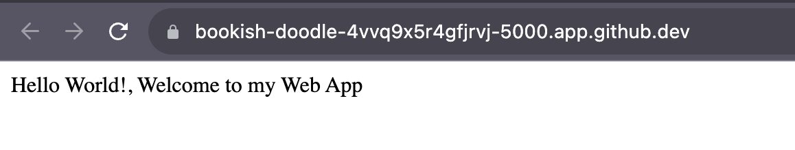
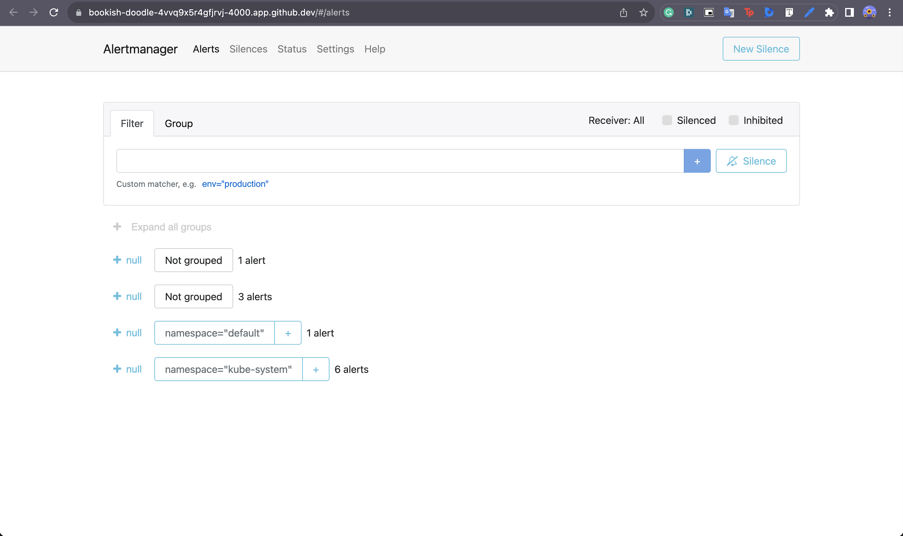
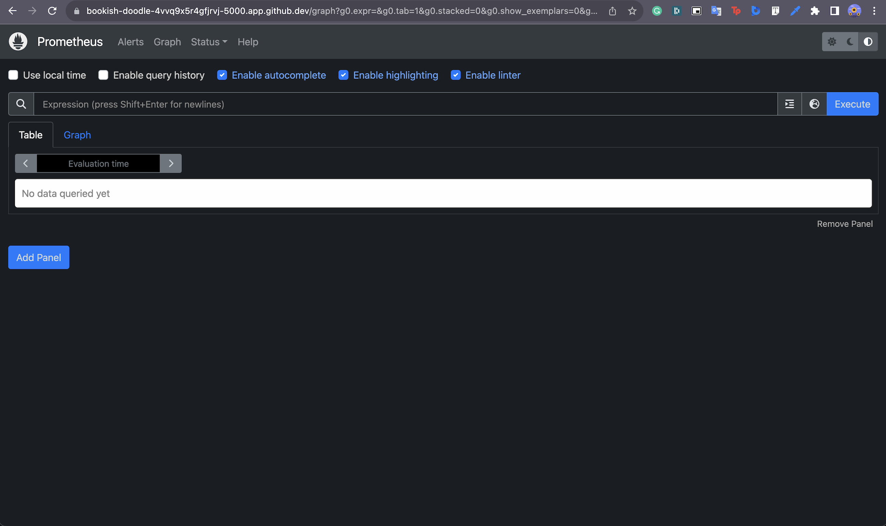
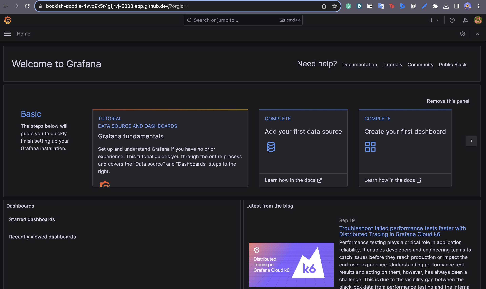

## Kind-K8s-Playground

# Task Summary

This project has several key tasks. It begins with the starting up of a Kubernetes cluster using Kind, a script tailored for local deployment, and the deployment of a Node.js application. Additionally, it involves the creation of a Docker image for a basic "Hello World" Express application, ensuring the secure storage of the kubeconfig. Moreover, a kubectl Terraform provider script is crafted to facilitate the deployment of the application to the Kind cluster. And eventually as an added benefit, the project implements monitoring by employing the kube-prometheus stack through a Terraform Helm provider.

# Applications to install
- Go
- Node
- Kind
- Docker
- Terraform
- Helm

# Result for Docker 

# Results for AlertManager

# Results for Prometheus

# Results for Grafana
